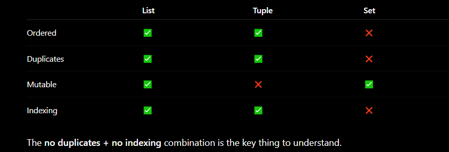

# Weclome to Learning Python with me 


## Table of Contents
- [1. Basics](#1-basics)
- [2. Variables](#2-variables)
- [3. Data Types](#3-data-types)
- [4. Input](#4-input)
- [5. 1st Exercise](#5-First-Exercise)
- [6. Type Casting/Conversion](#6-Type-Casting-or-Type-Conversion)
- [7. 2nd Exercise](#7-Second-Exercise)
- [8. String Operations](#8-string-operations)
- [9. 3rd Exercise](#9-Third-Exercise)
- [10. Operators](#10-Operator)
- [11. Condition if/else statements](#11-Conditional-statements) 
- [12. Mini Project Calculator](#12-mini-project-calculator)
- [13. loops](#13-loops)
- [14. 4th exercise](#14-Multiple-Exercises)
- [15. Python Data Structure](#15-Data-Structure)
- [Lists](#Lists)
- [Tuple](#Tuple)
- [Set](#Set)
- [Dictionary](#Dictionary)
- [16. 5th exercise](#16-Fifth-Exercise)
- 


-------------------------------------------------------------------------------------------------------------------------------------------------------------------------------


# 1-basics 

Python is case-sensitive.

print("Hello World")

print() is used to display output.  like print("Tea")   or   print(10)


print("Hello", "World")                        // Multiple values can be printed together.


> **Comments**

Use # for comments

and to selected multiple block of code just click Ctrl + /


> in terminal to use the previous command just press upwards arrow (↑)


- python is case senstive meaning print() will work but not Print()


------------------------------------------------------------------------------------------------------------------------------------------------------------------------------


# 2-variables 


A variable stores a value.

> For ex
name = "Sarbesh"
age = 26
cgpa = 8.5


> Here:
name → variable
"Sarbesh" → value
= → assignment operator

The assignment operator stores the value on the right-hand side in the variable on the left-hand side.

```
**Variables can be updated and the new variable will get printed **
age = 26
age = 25.5

print(age)
```

> Output:
25.5

- to print varibales just type print(variable name)  and no need of " " even its a string 


### variable  code- 
```
name = "Sarbesh"

first_name = "Sarbesh"
last_name = "Mallick"
age = 26 
gender = "male"
eye = "brown"
age = 100


print(first_name)
print(age)

print(gender , eye)

print(30)
```

>Output- 
Sarbesh
100
male brown
30 


--------------------------------------------------------------------------------------------------------------------------------------------------------------------------------


# 3-data-types


Python hv 4 primitive data types


| Type    | Meaning                | Example          |
| ------- | ---------------------- | ---------------- |
| str     | String / text          | "Sarbesh"        |
| int     | Integer / whole number | 25               |
| float   | Decimal number         | 8.5              |
| bool    | Boolean                | True / False     |


> Examples:

name = "Sarbesh"       # str
age = 25               # int
cgpa = 8.5             # float
isStudent = True       # bool


Boolean values must use capital letters:
True
False

Not: true and false. Python is case-sensitive.


### Checking the data type-


**Use the built-in type() function:**

print(type(variable name))


### type check code-
```
name = "Sarbesh"
age = 26
balance = 0.5 
gender = "Male"


print (type(name))

print (type(age))

print (type(balance))
```

> Output-
<class 'str'> 
<class 'int'> 
<class 'float'>


- type() tells us what type of value a variable currently contains.
- in c++ we need to define our variable values like for numbers int num = 5; but in python we can just declare it as it is without typing int
- to check what the type is we do print(type(variable name))


---------------------------------------------------------------------------------------------------------------------------------------------------------------------------------


# 4-input 


**Use input() to take input from the user.**


name = input("Enter your name: ") 
print(name)


### Eg code-

```
name = input("What is ur name: ")
profession = input(" what is ur job: ")
age = input("what is ur age: ")

print(name)
print(profession)
print(age)
```

> Input
What is ur name: Sarbesh
what is ur job: Dev
what is ur age: 16

>Output 
Sarbesh
Dev
16


### 6. Input code- 

```
name = input("Enter your name: ")

print("Namaste" , name)

```

> Input
Enter your name: Sarbesh

>Output- 
Namaste Sarbesh


### Tip- 

suppose my python filename is 6. Input.py 

- if we run this program using python filename.py then remember as I have used spaces so  use " "  in terminal 
- like for example-
    python "6. Input.py"


### Important- 

input() always returns a string.

Even if the user enters: 23
Python initially stores it as:  "23"   
not: 23

input returns a string even it is a number(int) 


--------------------------------------------------------


## Concatenation

concatenation means joining strings.

+ 


> for eg:

name = "Sarbesh"
print("Hello " + name)

>Output-
Hello Sarbesh 


> Remember
Be careful about spaces:

"Hello" + name 
produces:
HelloSarbesh


"Hello " + name
produces:
Hello Sarbesh


- The + operator can concatenate strings.


### 7. concatenation code-

```
name = input("Enter your name: ")

print("Hello Namaste " + name)
```

> Input
Enter your name: Sarbesh

> Output-
Hello Namaste Sarbesh


-----------------------------------------------------------------------------------------------------------------------------------------------------------------------------------


# 5-First-Exercise 


Problem stat-
Add a person with first name as Tony and last name as Stark.
Tony's age is 53.
Tony's height is 1.85m.
Tony is secretly a superhero. Take his superhero name as input & print it. --> 


```
first_name = "Tony"
last_name = "Stark"

age = 53
height = 1.85 

name = input("What is his superhero name: ")
print(name)

```

> Input 
What is his superhero name: Ironman

>Output 
Ironman 


-----------------------------------------------------------------------------------------------------------------------------------------------------------------------------------


# 6-Type-Casting-or-Type-Conversion


Because input() returns a string, we often need to convert it before performing calculations.

type casting     ->  when coders changes 
type conversion  ->  python interpreter automatically does it 


> Common conversion functions:
int()
float()
str()
bool()


### type casting code- 

```
age = input("Enter your age: ")

print (type(age))

print (age)

```

> Input
Enter your age: 23

> Output
<class 'str'>
23


> Note-
-  print (age + 1) ❌                                                                       // we cannot do this as age varibale value i.e 23 is passed as string 
-  see the age varibale is passed as string and not integer although 23 is an integer 
-  if we have to do print (age + 1)  we cannot do that 
-  it will show TypeError: can only concatenate str (not "int") to str


### Solution for this 

```
age = input("Enter your age: ")

age = int(age)

print (type(age))

print (age)
print (age + 1)

```


> Input
Enter your age: 23

> Output
<class 'int'>
23
24


- Now age is an integer 


---------------------------------------------------


## Temporary Conversion vs Reassignment 


Let's understand this with code-

```
old_age = input("Enter ur age: ")

new_age = int(old_age) + 2

print(new_age)

print (float(new_age))                              # here we converted int to float. It is not conversion but Reassignment 

print (type(new_age))

```


> Input- 
Enter ur age: 23

> Output- 
25
25.0
<class 'int'>


> Note-
- if u wondering after converting from int to float why class is int and not float because its a temporaray expression 
- new_age = float(new_age)            // to convert it permanently 


type casting     ->  when coders changes 
type conversion  ->  python interpreter automatically does it 


Conversion examples-
print (1 + 1.5)                // python converts 1 into 1.0 and will give you answer in float (decimal)


### Temporary Conversion-

age = 23

print(float(age))
print(type(age))

> Output:
23.0
<class 'str'>

- float(age) converted the value for that expression, but age itself remained a string.


### Permanent conversion / reassignment- 

age = 23

age = float(age) 

print(age)
print(type(age))


> Output
23.0
<class 'float'>


- The converted value was assigned back to age.


#### Easy rule

print(float(age))
→ temporary conversion
- converts the value for that expression; original variable remains unchanged.


age = float(age)
print(age)
→ conversion + reassignment
- converts the value and stores the converted value back in the variable.


You do not always need a new variable.


> For example:

print(float(age) + 1.2)

is perfectly valid when you only need the converted value temporarily.


### Another code eg-

```
age = input("enter age: ")

print(float(age) + 1.2)

print(type(age))

```

> Input
enter age: 23

> Output
24.2
<class 'str>


Temp conversion-
print(float(age))                // age is still a string 
 
Permanent Conversion- 
age = float(age)                // age is now float 


**OR**


age = input("enter age: ")
age = print(float(age) + 1.2)
print(type(age))

> Input
enter age: 23

> output
24.2 
<class 'NoneType'>


- variable e like for example age = ... amra bina brackets chara use korte pari if we add smthng +  Eg-  age = age(...) + 1
- but print e puro print statement ta bracket under e mane print(... + 1 )


-------------------------------------------------------------


## Explicit vs Implicit Conversion 


**Implicit Conversion-**

Python automatically performs a compatible conversion.


> Example:

print(1 + 1.5)

> Result:
2.5

- the above code is implicit is automatically converted by python intepreter, 1 (int) is converted into 1.0(float)
- Python promotes the integer to a float during the operation.


**Explicit Conversion / Type Casting-**

The programmer tells Python to convert the type.


> example:

print(1 + int(2.9999))

// Python is explicitly told to convert 2.9999 to an integer.

> Result:
3


> another example:
print (1 + int(1.5))            

- this is type casting
- here in the above code we forced (type casting) 1.5 to become int and it got casted into 1 , so 1 + 1 = 2
- Result: 2


> Summary

print (1 + 2.9999)                             // Type Conversion  (implicit)              // Result: 3.9999
print (1 + int(2.9999))                        // Type Casting     (explicit)              // Result: 3


--------------------------------------------------------------------------------------------------------------------------------------------------------------------------------


# 7-Second-Exercise 


Problem stat- Sum Program where a , b are integers nos & we hv to take input and calc the sum of a & b and print it

```
a = input("Enter first number: ")

b = input("Enter second number: ")

total = int(a) + int(b)                                                         

print("the sum is" , total)           

print(type(a))
print(type(total))

```


> Input
Enter first number: 10
Enter second number: 20

> Output
the sum is 30 
<class 'str'>
<class 'int'>


> Alt
a = int(input("Enter first number: "))                    
b = int(input("Enter second number: "))
total = (a + b)
print(total)


**OR**


```
a = int(input("Enter 1st number: "))
b = int(input("Enter 2nd number: "))

num_sum = a + b                                     

print("The sum of 2 integers is" , num_sum)

print(type(num_sum))
print(type(a))

```

> Input
Enter 1st number: 10
Enter 2nd number: 20

> Output
The sum of 2 integers is 30
<class 'int'>
<class 'int'>


------------------------------------------------------------------------------------------------------------------------------------------------------------------------------


# 8-string-operations 


- Strings have useful methods 
- Strings are immutable. 
- String operations do not modify the original string rather a new string is produced.


### let's understand from code- 

```
name = "Sarbesh Mallick "

print (name)

print (name.upper())

print (name.lower())

print (name)                                              //  the original value is intact 

```

> Output-
Sarbesh Mallick
SARBESH MALLICK
sarbesh mallick 
Sarbesh Mallick                                          //  the original value is intact cuz strings are immutable 


--------------------------------------


## find() method 


- find() searches for a substring/character and returns its index/position.
- returns no of the index and not boolean (true/false)


> example:

name = "Sarbesh"
print(name.find("b"))

> Output:
3


- If the character exists, Python returns its index.
- If it doesn't exist:
      name.find("z")
      
      returns:
      -1


> Summary:
find() → tells you where something occurs.
It does not simply return True or False.


### Code-

```
name = "Sarbesh Mallick"

print (name.find('M'))                                               // if that string exists then we will get the index of that thing 
```

> Output-
8

> Remember- 
find function returns index which is position
if we search something that is not present we will get -1 as value which is invalid 


## replace() method


replace() is a string method, not a standalone function.


> for eg:

name = "Sarbesh Mallick"
print(name.replace("Mallick", "Muthu"))

> Result:
Sarbesh Muthu


- You call it using .
- variable_name.replace(...)
- .replace()


### example code-

```
name = "Sarbesh Mallick"

print (name.replace("Sarbesh Mallick" , "Muthu"))
print (name.replace("Mallick" , "Muthu"))                           
print (name.replace("S" , "D"))                                         // when we need to replace smthng partial 

```

> Output-
Muthu
Sarbesh Muthu
Darbesh Mallick


## in operator 

- It is a check method. 
- it checks whether something exists or not and results comes in boolean (True/False)


> for eg 1

name = "Sarbesh"
print("S" in name)

> Result: 
True


> for eg 2
numbers = [10, 20, 30]
print(20 in numbers)

> Result:
True


#### not in 

> for eg 3

numbers = [10, 20, 30]
print(40 not in numbers)

> Result:
True


- in is a keyword in python dictionary, we cannot use in as a varibale name, in operator  job is to search 


### Note-

'S' in name
→ checks whether S exists anywhere

**Whereas:**

name.startswith('S')
→ checks whether the string starts with S.


### Function vs Method 

Functions are generally called independently:

print()
input()
int()
float()

Methods are called on an object:

name.upper()
name.lower()
name.replace()


- Functions → generally called independently: print(), input(), int()
- Methods → called using . on an object: "hello".upper(), "hello".replace()


---------------------------------------------------------------------------------------------------------------------------------------------------------------------------------


# 9-Third Exercise

Problem stat-
<!-- # Problem stat- 
# Take price of 3 products as input (eg - 99.5, 23.75, 16.15)
# print the total Bill amount
# print the average price
# Take a superhero name as input & check if it starts with 'S' / 's' or not. -->


```
first_product = 101.55
second_product = 99.95
third_product = 15.15 


total = int(first_product) + int(second_product) + int(third_product)

print(total)

print ("the average price is: " , total/3)

name = input("What's your supehero name: ")

print (name.startswith('s') or name.startswith('S'))                            // Alt-    print(name.startswith(('s', 'S')))     OR       print(name.lower().startswith('s'))

```


> Output-
215
the average price is:  71.66666666666667
What's your supehero name: Sarbesh
True


- if I want to check if S or s in the whole name is there or not then:
            print ('S' in name or 's' in name)


----------------------------------------------------------------------------------------------------------------------------------------------------------------------------------


# 10-Operator 


## Arithmetic Operator 
1. **Arithmetic Operators-** 


| Operator | Name                   | Example  |
| -------- | ---------------------- | -------- |
| +        | Addition               | 5 + 2    |
| -        | Subtraction            | 5 - 2    |
| *        | Multiplication         | 5 * 2    |
| /        | Division               | 5 / 2    |
| //       | Floor Division         | 5 // 2   |
| %        | Modulus / Remainder    | 5 % 2    |
| **       | Exponentiation / Power | 5 ** 2   |


print (5 + 3)                                   //  + is addition operator and 5,3 are operands 
print (5 - 3)
print (5 * 3)
print (5 / 3)                                   //   / is division operator 

print (5 // 3)                                 //    is floor division and completely removes the decimal part, only int part is left 

print (5 % 3)                                  //   % is modulus or remainder , very helpful to check even & odd

print (5 ** 3)                                 //   ** is exponent of or power of 5³   = 5*5*5 = 125 


1. 5/2        -> 2.5
2. 5 // 2     -> 2

    Very useful for checking even/odd:
    number % 2 == 0       → even
    number % 2 != 0       → odd

3. 5 ** 2    -> 25  (5² = 25)


--------------------------------------------------------------


### Operator Precedence

- Python follows operator precedence rules when multiple operators appear in an expression.
- just like in real life BODMAS is followed 
- operator precedence are rules that defines which operator has higher priority compared to other 


> For example:

2 + 5 * 3  
 = 17
Multiplication happens first


**But parentheses have higher priority:**
(2 + 5) * 3
Result: 21


**Basic rule to remember**
1. ()
2. **
3. * / // %
4. + -


- **For operators with the same precedence, evaluation generally proceeds from left to right.**

- **When in doubt, use parentheses to make the intended order clear.**

- if * and / both are present then our operations will start from Left -> Right 

- parantheses() have highest priority. 


-------------------------------------------------------------


## Operator comparison 
2. Operator Comparison 


Comparison operators compare values and produce a Boolean result: TRUE or FALSE 


| Operator | Meaning                  |
| -------- | ------------------------ |
| >        | Greater than             |
| <        | Less than                |
| >=       | Greater than or equal to |
| <=       | Less than or equal to    |
| ==       | Equal to                 |
| !=       | Not equal to             |


> Examples:

3 > 2
True

2 < 5
True

2 == 5
False

2 != 5                                // !=  is NOT operator 
True


### Remember-

= vs ==

= is the assignment operator:
age = 25
It assigns a value.


== is the comparison operator:
age == 25
It checks whether the values are equal.


= → assign
== → compare

This distinction is extremely important in if statements.


------------------------------------------------------


## Logical Operator 
3. Logical Operator 


- Python has three main logical operators:
and
or
not


1. and
Both conditions must be true.
(3 < 5) and (3 < 12)
→ True


> Conceptually:
True AND True → True
True AND False → False
False AND True → False
False AND False → False


2. or 
At least one condition must be true.
(3 > 5) or (3 > 2)
→ True


> Conceptually:
True OR True → True
True OR False → True
False OR True → True
False OR False → False


3. not 
Reverses a Boolean value.

not True
→ False

not False
→ True


- these operators work in statement or expression . for eg-   () or () 
  
or -> (atleast one statement is true)
and -> (both are true)
not -> (reverses any value)


> example

stt1 = 3 > 5                                      //  False
stt2 = 3 > 2                                     // True 

print (stt1 or stt2)                             // Ans True (cuz one statement stt2 is True )

print ((3 > 5) or (3 > 2))                      // we can write directly also 


print ((3 < 5) and  (3 < 12))                   // Ans True (both the statements are true )


# not operator always does the reverse 

print (not(3 > 2))                             //  Ans False , although it is true but as it is not so False 

print (not True)                               // Ans False 


----------------------------------------------------------------------------------------------------------------------------------------------------------------------------------


# 11-Conditional-statements 


Conditional statements allow Python to make decisions.
1. if
2. elif
3. else


#### example code1- 

```
age = 24 

if age >= 18:                                  # in cpp we use {} where if statement is true execute everything inside it. in py it is :
    print("you are adult")                      # 4 spaces . this is called identation which is proper spacing 
    print("you can vote")

elif age < 18:                                  # elif is else if . after if everything we can write in elif 
    print ("you can't vote / drive")

```

>output
you are an adult
you can vote 


#### example code 2- 

Problm stat- Marks are given out of 100. Assign a grade based on the marks:
80–100 → A
60–80 → B
60 → C
write a Python program using if, elif, and else to determine and print the grade.


```
marks = int(input("Enter marks: "))

if marks >= 80:
    print('A')

elif marks >= 60:
    print('B')

else:
    print('C')

```


> If you want to explicitly add into a range then follow this-

if marks >= 60 and marks <= 80:
    print("B")

- marks should be greater than or equal to 60 AND less than or equal to 80.


**Cleaner way-**
if 60 <= marks <= 80:
    print("B")


#### few more examples combing if/esle with operators

1. 
age = 25 

if age >= 18 and age <= 60: 
    print("Eligible")


2. 
name = input("Enter name: ") 

if "S" in name or "s" in name: 
    print("S exists") 
else: 
    print("S does not exist")


This combines:
in → membership operator
or → logical operator
if/else → conditional statement


----------------------------------------------------------------------------------------------------------------------------------------------------------------------------------


# 12-mini-project-calculator

Problem stat- 
<!-- # Build a calculator that can perform the following operations:

# a + b
# a - b
# a * b
# a % b
# a ** b -->


```
a = float(input("Enter first number: "))
b = float(input("Enter second number: "))

op = input("Enter operator (+, -, *, /, %, **): ")


if op == '+':
    print("Result:" , a+b)


elif op == '-':
    print("Result:" , a-b)


elif op == '*':
    print("Result:" , a*b)


elif op == '/':
    print("Result:" , a/b)


elif op == '%':
    print("Result:" , a%b)


elif op == '**':
    print("Result:" , a**b )


else:
    print("INVALID OPERATION")

```


--------------------------------------------------------------------------------------------------------------------------------------------------------------------------------


# 13-loops 


## Range 

- range() function returns a range object that is a sequence of numbers.   starts from 0 


#### Structure for Range

range(start, stop, step)

range (start=0, stop, step=1)                            // default value if nothing specified. but we have to write a stop value everywhere 


> Example 1- 

num = range(5)                           
print(num)                                      // 0,1,2,3,4


> Example 2-
num = range(2, 6)
print(num)                                    // 2,3,4,5


> Example 3-

num = range(10, 0, -2)
print(num)                                   // 10, 8, 6, 4 , 2


> we use range in loops like
for i in range(5):
    print(i)


----------------------------------------------------


## while loop 


> Example 1

counter = 1
while counter <= 5:
    print("Sarbesh win")
    counter = counter + 1

> Output:
Sarbesh win
Sarbesh win
Sarbesh win
Sarbesh win
Sarbesh win


> Example 2

counter = 1                                               //  for counter we give variable name as i 
while counter <= 5:
    print(counter)
    counter = counter + 1


>Output:
1
2
3
4
5


> Example 3

i = 0

while i < 5:
    print(i)
    i = i + 1


> Output:
0
1
2
3
4


- if we encounter infinite loop just press Ctrl + C to stop it


> production

- A while loop is useful when you don't necessarily know beforehand how many iterations you'll need.
  
```
password = ""

while password != "python123":
    password = input("Enter password: ")

```

- Here we don't say: Run this 5 times.
- Instead: Keep running while the condition is true.
  
- for loop -> Iterate over a known sequence/range.
- while loop -> Continue until some condition changes.


> Danger of while loop

```
i = 0

while i < 5:
    print(i)

```

- This never changes i.
- So
    i = 0
    0 < 5 → True
    print
    0 < 5 → True
    print
    0 < 5 → True
    print

- That's an infinite loop.

- we normally need state change
  
  i = 0
while i < 5:
    print(i)
    i = i + 1


>>>  Example 1 of pattern printing using while

i = 1
while i <= 5:
    print(i * '*')
    i = i + 1


> Output
*
**
***
****
*****


### Explaination- 
whenever an integer number is multiplied by a string, that no of times the strings gets repeated.  Multiplication * here is used as concatenation 


>>> like for eg
i = 1
while i <= 5:
    print(i * 'hello')
    i = i + 1

> Output:
hello
hellohello
hellohellohello
hellohellohellohello
hellohellohellohellohello


>>> Reverse pattern printing using while 

i = 5
while i > 0:
    print(i * '*')
    i = i - 1


> Output
*****
****
***
**
*


----------------------------------------------------------------------


## for loop 


> Example 1

for i in range(5):
    print(i)


> Output:
0
1
2
3
4


>>> Another example

nums = range(5)

for i in nums:
  print(i)


> Output
0
1
2
3
4


> Example 2

for i in range(2,6):
    print(i)

> Output:
2
3
4
5


- if its
   i in range(2,6,2):
   print(i)                            // 2 4 

- if its 
    i in range(2,6,5)
    print(i)                           // 2


> Example 3: Another way of finding even numbers 

for i in range(2, 11, 2):         
      print(i)

> Output:
2
4
6
8
10


> Example 4: Cleaner approach for finding even numbers 

for i in range(1, 11):                                                        // to check even no 
    if i % 2 == 0:
        print(i)

> Output:
2
4
6
8
10
  


>>> Example 5: printing multiples of 3 from (1 to 30)

for i in range(1,31):
  if i % 3 == 0:
    print(i)


> Output
3
6
9
12
15
18
21
24
27
30


#### Default structure of range 

range (start, stop, step )
range (optional, must, optional)
range (0,must,0)


#### Concept of for loop 

in c++ we use for loops like this

for (int i = 0; i < 5; i++) {
    cout << i;
}


Python doesn't require you to manually write:
- initialization
- condition
- increment


Instead
for i in range(5):

means   "Take each value produced by range(5) and assign it to i, one at a time."


> for loop dosen't require range() always 

- Python's for loop can directly iterate over collections.

```

names = ["Sarbesh", "Rahul", "Amit"]

for name in names:
    print(name)

```

> Output
Sarbesh
Rahul
Amit


> Why this matters in production

Imagine you're processing data from an API:

```
users = get_users()

for user in users:
    process_user(user)

```

You don't care whether there are 10 users or 10,000 users.


-------------------------------------------------------------------


## break 

- It means Immediately terminate the current loop.


> Example 1

for i in range(10):
    if i == 5:
        break

    print(i)


> Output
0
1
2
3
4


- when i == 5 becomes true , Python executes break.  The Loop ends immediately 


>>> Example 2: printing multiples of 3 from (1 to 30) but stop when number reaches 21 

for i in range(1,31):
  if i == 21:
    break
  if i % 3 == 0:
    print(i)

print("out of loop")


> Output
3
6
9
12
15
18
out of loop 


> Production : when break is uselful?

Imagine searching for something:

numbers = [4, 7, 2, 9, 15, 3]

for number in numbers:
    if number == 9:
        print("Found!")
        break

- Once you've found what you're looking for, there's no reason to continue searching.


---------------------------------------------------------------------


## continue 

- It means Stop the current iteration right here and immediately move to the next iteration. 
- skiping some particular iteration 


> example 1

for i in range(1, 6):

    if i == 3:
        continue

    print(i)


> Output
1
2
4
5


> Trace:

**Iteration 1**
i = 1
i == 3? No
print(1)


**Iteration 2**
i = 2
i == 3? No
print(2)


**Iteration 3**
i = 3
i == 3? Yes
continue                         // python dosent execute print(i)  .   It jumps back to the loop and starts the next iteration.


**Iteration 4**
i = 4
print(4)


**Iteration 5**
i = 5
print(5)


> Remember

break
  ↓
EXIT LOOP COMPLETELY


continue
  ↓
SKIP THIS ITERATION
  ↓
NEXT ITERATION


> Production : A realistic use of continue 

Suppose you're processing numbers and only want to work with positive numbers:

```
numbers = [10, -5, 20, -3, 30]

for number in numbers:

    if number < 0:
        continue

    print(number)

```

> Output
10
20
30


- here continue means Negative numbers aren't relevant to this processing, so skip them.  Filtering Logic 


>>> Example: printing multiples of 3 from (1 to 30) but skip the number 21 

for i in range(1,31):
  if (i == 21):
    continue
  if (i % 3 == 0):
    print(i)


> Output
3
6
9
12
15
18
24
27
30


----------------------------------------------------------------------------


## Nested loop

- A loop inside another loop 


>>> Example

for i in range(3):
    for j in range(3):
        print(i, j)


> trace:

Outer loop starts: i = 0
Inner loop:
j = 0 → print(0, 0)
j = 1 → print(0, 1)
j = 2 → print(0, 2)


Outer loop: i = 1
Inner loop starts again from begining 
j = 0 → print(1, 0)
j = 1 → print(1, 1)
j = 2 → print(1, 2)


Outer loop: i = 2
and again inner loop:
j = 0
j = 1
j = 2


> Output:
0 0
0 1
0 2
1 0
1 1
1 2
2 0
2 1
2 2


#### Mental model
The inner loop completes all its iterations for every single iteration of the outer loop.


#### Why nested loops matter for interviews?


Suppose:

for i in range(n):
    for j in range(n):
        print(i, j)


- The outer loop runs n times.
- For each outer iteration, the inner loop runs n times.
- therefore, n × n = n²
- time complexity ->  O(n²)


You'll encounter them in:
matrix problems
2D arrays
brute-force solutions
pair comparisons
sorting algorithms
graph algorithms
pattern problems


#### nested loops + break

Consider:

for i in range(3):

    for j in range(5):

        if j == 2:
            break

        print(i, j)


- break breaks the inner loop only and not outer loop 

for i = 0
inner loop:
j = 0 → print
j = 1 → print
j = 2 → break


> Output
0 0
0 1
1 0
1 1
2 0
2 1


----------------------------------------------------------------------------------------------------------------------------------------------------------------------------------
 


# 14-multiple-exercises


1. Problem stat- Print all odd numbers from 1 to 20 

```
for i in range(1,21):
  if (i % 2 != 0):
    print(i)

```

> Output
1
3
5
7
9
11
13
15
17
19


#### ALternative way 

for i in range(1,21,2):
    print(i)


------------------------------------------------


2. Problem stat- Print the table of 57

```
for i in range(1,11):
  print(57 * i)

```

> Output
57
114
171
228
285
342
399
456
513
570


#### refined way 

```
for i in range(1, 11):
    print(57, "x", i, "=", 57 * i)

```

> Result:
57 x 1 = 57
57 x 2 = 114
57 x 3 = 171
.. .. .... 


#### same thing with while loop 

```
i = 1

while i <= 10:
    print(57 * i)
    i = i + 1

```


#### Alt way of writing in while 

```
i = 1

while i in range(1, 11):
    print(57 * i)
    i = i + 1

```


- while expects condition in True or False  unlike for loop but this thing can also work 
- but in real production code, you would usually use while with a condition that expresses the actual stopping rule rather than i in range(...).


#### Real usage of while 

while password != correct_password:
    password = input("Enter password: ")


while not connected:
    connect_to_server()


while queue:
    item = queue.pop(0)
    process(item)


for → "Go through these things / repeat this known number of times."
while → "Keep doing this until this condition changes."


--------------------------------------------------------------------


3. Problem stat- Print all multiples of 3 from 1 to 50 but skip 15 

```
for i in range(1,51):
  if (i == 15):
    continue 
  if (i % 3 == 0):
    print(i)

```

> Output
3
6
9
12
18
21
24
27
30
33
36
39
42
45
48


--------------------------------------------------------------------


4. Take two integers a and b as input. Find and print the first number between 1 and 1000 that is divisible by both numbers.


```
a = int(input("Enter first number: "))
b = int(input("Enter second number: "))


for i in range(1,1001):
  if (i % a == 0) and (i % b == 0):
    print("The first no to be divisible by both" , i)
    break

```


> Output
Enter first number: 4
Enter second number: 5
The first no to be divisible by both 20


Enter first number: 4
Enter second number: 6
The first no to be divisible by both 12


#### Remember

  %   ->   "What is the remainder when the LEFT number is divided by the RIGHT number?"


**X % Y == 0**

20 is divisible by 5
20 % 5 == 0

36 is divisible by 9
36 % 9 == 0

i is divisible by a
i % a == 0


------------------------------------------------------------------------------------------------------------------------------------------------------------------------------


# 15-Data-Structure 

Lists- []
tuple= ()
set = {}
dict = {}


# Lists 

- A list stores multiple values in one variable. 
- It is written using square brackets []
- A list can contain values of different data types.
- Lists are Mutuable. You can change the contents of the list after creating it. 


Let's say I want to type marks of different students and I need to type everytime seperately like:
marks1 = 99
marks2 = 90
marks3 = 50

List solves it by grouping related values into one variable like:
marks = [99, 90, 50]

marks = [99, 90, 50]
         ↑   ↑   ↑   
         0   1   2        // indexes 


- A list can contain different data types
    data = [10, "Python", 3.14, True]

- Python allows this, although in production code you'll usually have logically related data in a list.


>>> example 1 

marks = [96, 98, 67, 'S']

print(marks)
print(len(marks))                                        // calculating the length of the list 


> Output:
[96, 98, 67, 'S']
4


### Accessing elements- indexes 


>>> Example 2

names = ["Sarbesh", "Rahul", "Amit"]
print(name[0])


> Output
Sarbesh


- Python, like C++, uses zero-based indexing.

- Index:   0          1        2
        ↓           ↓        ↓
      Sarbesh     Rahul     Amit


names[0]    //  Sarbesh
names[1]    //  Rahul
names[2]    //  Amit


>>> Example 3: Negative Indexing 

names = ["Sarbesh", "Rahul", "Amit"]
print(names[-1])

> Output:
Amit 


- Because -1 means last element.

- Index:    0        1        2
           -3       -2       -1
            ↓        ↓        ↓
        Sarbesh    Rahul     Amit


names[-1]  # last               // Amit 
names[-2]  # second last        // Rahul 


----------------------------------------------------


### Lists are mutuable 

Lists are mutable, meaning their elements can be added, removed or changed.


>>> example 4

marks = [98, 97, 95]
marks[0] = 100

print(marks)


> Output:
[100, 97, 95]


>>> example 5
marks = [85, 72, 91]
marks[1] = 80

print(marks)


> Output:
[85, 80, 91]


- The list itself was modified.

List → mutable
Tuple → immutable


----------------------------------------------


## Adding elements — append()

- append() adds an element at the end of the list 


>>> Example 6 

names = ["Sarbesh", "Rahul"]
names.append("Amit")

print(names)


> Output:
["Sarbesh", "Rahul", "Amit"]


## Adding at a particular position — insert()

- insert() adds an element at a particular position. 


>>> Example 7: Suppose you want name Rahul between 2 names that is in 2nd postion 

names = ["Sarbesh", "Amit"]

names.insert(1, "Rahul")

print(names)


> Output:
["Sarbesh", "Rahul", "Amit"]


- The first argument is the position, and the second is the value.

Syntax-
list.insert(index, value)


---------------------------------------------------------------


## Removing elements 


#### remove()

- remove() removes the value you specify.

>>> Example 8 
names = ["Sarbesh", "Rahul", "Amit"]
names.remove("Rahul")

print(names)


> Output
["Sarbesh", "Amit"]


#### pop()

>>> Example 9
names = ["Sarbesh", "Rahul", "Amit"]
names.pop()                                                               // pop() removes the last element unless specified 

print(names)

> Output:
["Sarbesh", "Rahul"]


>>> Example 10 
names = ["Sarbesh", "Rahul", "Amit"]
names.pop(1)                                                             // pop(1) means remove the element at index 1 

print(names)


> Output
['Sarbesh', 'Amit']


#### pop() returns the removed element 

removed = names.pop()
print(removed)


#### clear()


>>> Example 11

marks = [98, 97, 95, 93.5, "A"]
marks.clear()

print(marks)
print(len(marks))

> Output
[]
0


----------------------------------------------------------


#### checking for an element 

>>> Example 12

marks = [98, 97, 95, 93.5, "A"]
print(95 in marks)
print(99 in marks)

> Output
True
False


------------------------------------------------------


### Remember- 

num = range(5)
print(num)

Output-
range(0, 5)           

❌ I will not get 0,1,2,3,4 . For that I need to convert them into list 


> Code:

num = range(5)
print(list(num))

> Output-
[0, 1, 2, 3, 4]


-----------------------------------------------------


## looping directly over a list


>>> Example 13: just see this , its not looping 

numbers = [10, 20, 30, 40]
print(numbers)


> Output
[10, 20, 30, 40]


>>> Example 14: Looping directly over a list (pythonic)

numbers = [10, 20, 30, 40]
for number in numbers:
  print(number)


> Output
10
20
30
40


>>> Example 15: by using range and len. I can use Eg 14 and I don't need this process

numbers = [10, 20, 30, 40]
for i in range(len(numbers)):
    print(numbers[i])


> Output
10
20
30
40


- Both are valid. (Eg 14 & 15). The first is usually cleaner when the index isn't needed. First is more pythonic 


### Concept


**Eg 14: First approach — iterate over the values**

```
numbers = [10, 20, 30, 40]

for number in numbers:
    print(number)

```

- Python directly takes each element/value from the list.
- So number is actually holding the value.
- You don't care where the value is located.
- This is usually what you use in production
  
number → VALUE


For example, suppose you get users from a database/API:
```
users = ["Alice", "Bob", "Charlie"]

for user in users:
    send_email(user)

```
- For every user, send an email. You don't care whether Alice is at index 0 or index 500.


**Eg 15: Second approach — iterate over indexes**

```
numbers = [10, 20, 30, 40]

for i in range(len(numbers)):
    print(numbers[i])

```

- 1st,  len(numbers) gives 4
- 2nd,  range(4) gives 0 1 2 3 
- 

So, the loop does:
i = 0 → numbers[0] → 10
i = 1 → numbers[1] → 20
i = 2 → numbers[2] → 30
i = 3 → numbers[3] → 40

- Here i is not the value.  i is the index/location.

i → INDEX


#### Why we need index then?

1. Suppose you want to modify elements based on their position.
numbers = [10, 20, 30, 40]
- u want to double very element 

```
numbers = [10, 20, 30, 40]
for i in range(len(numbers)):
    numbers[i] = numbers[i] * 2
    print(numbers[i])

```

> Output
20
40
60
80


2. and there's another use case: Print the position of every number.

```
numbers = [10, 20, 30, 40]

for i in range(len(numbers)):
    print("Index:", i, "Value:", numbers[i])

```

> Output
Index: 0 Value: 10
Index: 1 Value: 20
Index: 2 Value: 30
Index: 3 Value: 40


>>> Wrong version of Example 15: ❌

numbers = [10,20,30,40]
for i in range(numbers):
    print(numbers[i])

Error-> TypeError: 'list' object cannot be interpreted as an integer


- python can read what's there in numbers in list format 
- but range() needs integer values whereas in list integer, char, bool everything can get stored 
- python don't assume range([])  ,  it needs range(5)  or range(2,6) or something integer bound 
- so len(numbers) solves this.  if  numbers = [10,20,30,30]   then len(numbers) produces 4  
- len produces 4, so range(4) 
- range(4) means 0,1,2,3 


>>> Example 16: When we need index 

numbers = [10, 20, 30]

for i in range(len(numbers)):
    print(i, numbers[i])


> Output
Output->
0 10
1 20
2 30


#### python list vs C++ vector comparison 


1. Python:

numbers = [10, 20, 30]
numbers.append(40)


2. C++

vector<int> numbers = {10, 20, 30};
numbers.push_back(40);


| Python          | C++                     |
| --------------- | ----------------------- |
| list            | vector                  |
| list[index]     | vector[index]           |
| append()        | push_back()             |
| len(list)       | vector.size()           |
| for x in list   | for (auto x : vector)   |


So:
list → collection of VALUES
range → generates NUMBERS
len → tells me HOW MANY values are in the list


--------------------------------------------------------------


## slicing 

- Slicing extracts part of a list
- it means Taking a portion of a list without changing the original list.


numbers = [10, 20, 30, 40, 50]
Indexes:

Value:    10   20   30   40   50
Index:     0    1    2    3    4
          -5   -4   -3   -2   -1


1. **Basic syntax**

list[start:stop]

start is included, stop is excluded.

> Eg:
numbers = [10, 20, 30, 40, 50]
print(numbers[1:4])


means:
start at index 1
↓
20  30  40
         ↑
      stop at 4 (not included)


> Output:
[20, 30, 40]


2. **Leaving start or stop empty**

> Eg: from the beginning 
numbers = [10, 20, 30, 40, 50]
print(numbers[:3])                                                     // Start from the beginning and stop before index 3.


> Output
[10, 20, 30]


> Eg: Until the end 
numbers = [10, 20, 30, 40, 50]
print(numbers[2:])


> Output
[30, 40, 50]


3. **So,**

numbers[:3]   # beginning → index 3
numbers[2:]   # index 2   →  end


4. **Adding a step**

list[start:stop:step]


> Eg
numbers = [10, 20, 30, 40, 50]
numbers[0:5:2]

Start at 0, stop before 5, jump by 2:


> Output
[10, 30, 50]


5. **Reverse a list**

numbers = [10, 20, 30, 40, 50]
numbers[::-1]

> Output
[50, 40, 30, 20, 10]


#### Remember 

1. numbers[start:stop:step]

2. numbers[1:4]
   1, 2, 3


3. numbers[:3]   # beginning → 2
   numbers[2:]   # 2 → end


4. numbers[::2]    # every 2nd element
   numbers[::-1]   # reverse


#### Helpful in interview / prod 

first_three = numbers[:3]
last_three = numbers[-3:]


-------------------------------------------------------------------------------------------------------------------------------------------------------------------------------


# Tuple


- A tuple stores multiple values and is written using parentheses () 
- Tuples are immutable, so their elements cannot be changed
- we use Tuple, when we want fixed values and not something changeable like GPS coordinates 


>>> Example 1

numbers = (10, 20, 30, 40)
print(numbers)

> Output
(10, 20, 30, 40)


1.  we can access the element just like the list.
 
numbers = (10, 20, 30, 40)
print(numbers[0])

> Output
10 


2. Indexing and slicing works in tuple also 
numbers[-1]
numbers[1:3]


3. **I cannot modify** 

numbers = [10, 20, 30]                 // List can modify 
numbers[0] = 100
print(numbers)                         // [100, 20, 30]


numbers = (10, 20, 30)                 ❌❌❌
numbers[0] = 100


- Because tuples are immutable.
- Once the tuple is created, you cannot modify its elements.


4. Different data types supported just like List 
person = ("Sarbesh", 24, True)


5. I can loop through tuple 

numbers = (10, 20, 30, 40)
for number in numbers:
    print(number)


6. append()   ❌
   remove()   ❌
   pop()      ❌
   insert()   ❌


7. count()    ✔
   index()    ✔


>>> Example 1

numbers = (10, 20, 20, 30)
print(numbers.count(20))

> Output
2


>>> Example 2

numbers = (10, 20, 20, 30)
print(numbers.index(30))

> Output
3


8. Single element tuple needs a comma 

x = (10, 20, 30)   ✔
x = (10,)          ✔
x = 10             ❌                   // this is an integer 


9. In Python code, you'll commonly encounter tuples when:

a function returns multiple values
representing fixed groups of values
working with dictionary keys
working with database/query results
unpacking values


```
person = ("Sarbesh", 24)

name, age = person

print(name)
print(age)

```

> Output
Sarbesh
24

- Here the tuple contains two related values, and Python unpacks them into two variables.


--------------------------------------------------------------------------------------------------------------------------------------------------------------------------------


# Set


- A set stores unique values and is written using curly brackets {}
- Repeated values are automatically removed.
- Sets are unordered, so their display order is not guaranteed. 
- They also do not support indexing.
- looping is allowed 


>>> Example 1
numbers = {10, 20, 10, 30, 20, 40}
print(numbers)

> Output
{10, 20, 30, 40}                                                   // removing the duplicates 


#### 3 characteristics of Set-
1. Unique elements 
2. Unordered 
3. Mutable
4. No duplicates + no indexing 





#### Sets dont hv indexes 

- within a list:
numbers = [10, 20, 30]
print(numbers[0])

Output- 
10


- in set:
numbers = {10, 20, 30}
print(numbers[0])

Output-
❌error 
Because a set doesn't maintain elements in a meaningful positional order.


#### Real life-

1. checking permissions 

permissions = {"read", "write", "delete"}
if "write" in permissions:
    print("User can write")

- You don't care whether "read" is conceptually first or "delete" is third.
- You care about: Does this permission exist?


2. Membership checking

**we can use-**
if value in my_set:


**eg-**

allowed_roles = {"admin", "manager", "developer"}
if "developer" in allowed_roles:
    print("Access granted")


#### Adding elements     .add()

- Because sets are mutable, you can add elements.

>>> Example 2 

numbers = {10, 20, 30}
numbers.add(40)
print(numbers)

> Output
{10, 20, 30, 40}


but if u want to add 
numbers.add(20) 
nothing changes cuz no duplicates in sets 


#### Removing elements   .remove() , .discard()

>>>> example 3 

numbers = {10, 20, 30}
numbers.remove(20)
print(numbers)

> Output
{10, 30}

- we can also use discard instead of remove. remove checks if element exists or not before removing but discard dosen't checks 


>>> exmaple 4
numbers = {10, 20, 30}
numbers.discard(50)                           // 50 dosent exists 
print(numbers) 

> Output
{10, 20, 30}


#### looping over a set can be done but it is not ordered so be careful 


#### Set Operations 


>>> Example 5: Union

A = {1, 2, 3, 4}
B = {3, 4, 5, 6}

print(A | B)                              // Union (|) - Values present in either set                // combine both sets and remove duplicates 

> Output
{1, 2, 3, 4, 5, 6}


>>> Example 6: Intersection 

A = {1, 2, 3, 4}
B = {3, 4, 5, 6}

print(A & B)                            // Intersection (&) - Values present in both                 // What do they have in common?   // useful in data processing 

> Output
{3, 4}


>>> Example 7: Difference 

A = {1, 2, 3, 4}
B = {3, 4, 5, 6}

print(A - B)                            // Difference (-)  - What does A have that B doesn't?   

> Output
{1, 2}


#### Real world example of Set operations 

>>> Example 8 

frontend = {"React", "JavaScript", "HTML", "CSS"}

backend = {"Python", "SQL", "JavaScript", "Docker"}


print(frontend & backend)      ->  {"Javascript"}                                                                       // Technologies known by both

print(frontend | backend)      ->  {"React", "JavaScript", "HTML", "CSS", "Python", "SQL", "Docker"}                    // All technologies

print (frontend - backend)     ->  {"React", "HTML", "CSS"}                                                             // Frontend technologies not in backend


#### Converting a list into Set 

>>> Example 9

numbers = [10, 20, 10, 30, 20, 40]
unique_set = set(numbers)

print(unique_set)

> Output
{40, 10, 20, 30}                                                // as usual not ordered 


#### Syntax Trap 

- An empty set is not {}
- it is set()
- {}   ->   Dictionary 

Dictionary:
x = {}    

Set:
x = set()


>>> example code

numbers = {10, 20, 10, 30, 10}

print(numbers, len(numbers))

for value in numbers:
  print(value)


> Output
{10, 20, 30} 3
10
20
30


---------------------------------------------------------------------------------------------------------------------------------------------------------------------------------


# Dictionary 


- A dictionary is a set of key value & pairs
- key & its pair is denoted by :    like key : pair
- key and its pair is sperated from another key and its pair by comma , 
- key1 : pair1 , key2 : pair 2
- we create dict by {} 
- syntax- {}
- dictonaries are mutable just like lists and sets 


#### Now imagine a situation

- with a list we can access postion/index like for eg- numbers[0]
- but we have to remember the the index right like 0 here which is not so readable


>>> example 

Name → Sarbesh
Age → 24
Role → Developer


**Using a list:**
person = ["Sarbesh", 24, "Developer"]

now u need to remember:
0 → name
1 → age
2 → role


- A dictionary lets us associate a key with a value

**Using dict:**

person = {
    "name": "Sarbesh",
    "age": 24,
    "role": "Developer"
}

print(person["name"])                                       // now we can directly say person("[name]") and get Sarbesh so      print(variable["key"])

> Output
Sarbesh 


print(person)

> Output
{'name': 'Sarbesh', 'age': 24, 'role': 'Developer'}


**So**
List:
index → value

Dictionary:
key → value


>>> example 2 

marks = {"maths" : 99, "Physics" : 80, "Chemistry" : "Fail"}
print(marks, "&&&" , type(marks), "&&&" ,  len(marks))

> Output
{'maths': 99, 'Physics': 80, 'Chemistry': 'Fail'} &&& <class 'dict'> &&& 3


#### we access value in dictionary using key 

person = {
    "name": "Sarbesh",
    "age": 24,
    "role": "Developer"
}

print(person["name"])
print(person["age"])

> Output-
Sarbesh
24


print(person[0])  ->  ❌             // dictonaries expect a key 


#### useful scenarios in API call

user = {
    "id": 101,
    "name": "Sarbesh",
    "email": "sarbesh@example.com",
    "active": True
}

- I can directly acess email by    user["email"]


-----------------------------------------------------------


#### Dictonaries are mutable

>>> example

person = {
    "name": "Sarbesh",
    "age": 24
}

person["age"] = 25
print(person)


> Output
{"name": "Sarbesh", "age": 25}


------------------------------------------------------


#### Adding a key value pair : we dont need add()

>>> example

person = {
    "name": "Sarbesh",
    "age": 24
}

person["city"] = "Bengaluru"

print(person)

> Output
{'name': 'Sarbesh', 'age': 24, 'city': 'Bengaluru'}


- if city dosen't exists create it , if it exists update its value 


#### removing data : .pop() or del

>>> example 

person = {
    "name": "Sarbesh",
    "age": 24,
    "role": "Dev"
}

person.pop("age")
del person ["role"]

print(person)

> Output
{'name': 'Sarbesh'}


-------------------------------------------------------------


#### checking whether key exists or not 

- u can't search for pair, u hv to search key 


>>> eg

person = {
    "name": "Sarbesh",
    "age": 24,
    "email": "sarbeshmk@gmail.com"
}

if "email" in person:
  print(person["email"])

if "name" in person:
  print(person["name"])


> Output
sarbeshmk@gmail.com
Sarbesh


if "Sarbesh" in person -> ❌          // cuz "Sarbesh" is a key and not value 
if "name" in person -> ✔


**OR**


person = {
    "name": "Sarbesh",
    "age": 24,
    "email": "sarbeshmk@gmail.com"
}

print("name" in person)
print("role" in person)

> Output
True
False


------------------------------------------------------------------


#### .get() method 

- very frequently used with API/JSON data where some fields are missing


>>> eg
person = {
    "name": "Sarbesh",
    "age": 24
}

person["email"]  -> KeyError    // email dosen't exists 

**To mitigate this:**

person.get("email")                                    returns  none 

OR

person.get("email", "Not provided")                   returns Not provided 


>>> example

person = {
    "name": "Sarbesh",
    "age": 24
}

print(person.get("email"))

> Output
None


print(person.get("email", "Not provided"))         ->   Not provided 


>>> example

person = {
    "name": "Sarbesh",
    "age": 24
}

print(person.get("email", "Not provided"))
print(person.get("name", "Not provided"))

> output
Not provided
Sarbesh 


-----------------------------------------------------------


#### Looping through dictionary 


**Just Keys**

- Python's default dictionary iteration is over keys


>>> example

person = {
    "name": "Sarbesh",
    "age": 24
}

for key in person:
  print(key)


> Output
name
age


**Keys and Value**

- we can use .items()

>>> example

person = {
    "name": "Sarbesh",
    "age": 24
}

for key, value in person.items():
  print(key, value)                                                           //  print(key, ":", value)   we can add colon to make it more natural 


> Ouput
name Sarbesh
age 24


**OR** 


person = {
    "name": "Sarbesh",
    "age": 24
}

for key in person:
  print(key, person[key])


> Output
name Sarbesh
age 24


**If you wan to print only values**

>>> eg

person = {
    "name": "Sarbesh",
    "age": 24
}

for value in person.values():
  print(value)

> output
Sarbesh
24


1. python dosent care about variable name here. 
2. like for keys i cam literally do:
        person = {
       "name": "Sarbesh",
       "age": 24
        }
          for value in person:
            print(value)

it will output-                                        // here i want values but got keys so keys looping is default so here store the key in varibale named value 
name                                                   // if u need values then for x in person.values()
age

3. even with keys and values
      
      person = {
        "name": "Sarbesh",
        "age": "24
      }
        for x,y in person.items():
            print(x,y)

output-
name Sarbesh
age 24
    


-----------------------------------------------------------------


#### Dictionary + Lists 


>>> example

users = [
    {"name": "Alice", "age": 25},
    {"name": "Bob", "age": 30},
    {"name": "Charlie", "age": 28}
]

for user in users:
    print(user["name"])


> output
Alice
Bob
Charlie


### model-

List
 ├── Dictionary
 ├── Dictionary
 └── Dictionary


>>> interesting example 1

users = [
    {"name": "Alice", "age": 25},
    {"name": "Bob", "age": 30},
    {"name": "Charlie", "age": 28}
]

for user in users:
    print(user)


> output
{'name': 'Alice', 'age': 25}
{'name': 'Bob', 'age': 30}
{'name': 'Charlie', 'age': 28}


>>> interesting example 2

users = [
    {"name": "Alice", "age": 25},
    {"name": "Bob", "age": 30},
    {"name": "Charlie", "age": 28}
]

for user in users:
    print(user)
    print(user["name"])


> output
{'name': 'Alice', 'age': 25}
Alice
{'name': 'Bob', 'age': 30}
Bob
{'name': 'Charlie', 'age': 28}
Charlie


>>> interesting example 3

users = [
    {"name": "Alice", "age": 25},
    {"name": "Bob", "age": 30},
    {"name": "Charlie", "age": 28}
]

for user in users:
    print(users)


> output
[{'name': 'Alice', 'age': 25}, {'name': 'Bob', 'age': 30}, {'name': 'Charlie', 'age': 28}]
[{'name': 'Alice', 'age': 25}, {'name': 'Bob', 'age': 30}, {'name': 'Charlie', 'age': 28}]
[{'name': 'Alice', 'age': 25}, {'name': 'Bob', 'age': 30}, {'name': 'Charlie', 'age': 28}]


>>> example 4

users = [
    {"name": "Alice", "age": 25},
    {"name": "Bob", "age": 30},
    {"name": "Charlie", "age": 28}
]

print(users)

> output
[{'name': 'Alice', 'age': 25}, {'name': 'Bob', 'age': 30}, {'name': 'Charlie', 'age': 28}]


----------------------------------------------------------------------


#### Dictionary + Dictionary 

>>> example

user = {
    "name": "Sarbesh",
    "address": {
        "city": "Delhi",
        "country": "India"
    }
}

print(user["address"]["city"])

> output
Delhi 


>>> example 

user = {
    "name": "Sarbesh",
    "address": {
        "city": "Delhi",
        "country": "India"
    }
}

print(user["address"])

> output
{'city': 'Delhi', 'country': 'India'}


------------------------------------------------------------


#### dictionary vs set 


1. Set 
numbers = {10, 20, 30}

2. dict 
person = {"name": "Sarbesh", "age": 24}


3. Remember
Set:
{value, value, value}

Dictionary:
{key: value, key: value}


4. empty dictionary 

{}


5. empty set 

set()


-----------------------------------------------


### why dict matter in interviews

You want:
1 → 1
2 → 2
3 → 3

>>> example

numbers = [1, 2, 2, 3, 3, 3]
frequency = {}

for number in numbers:
    frequency[number] = frequency.get(number, 0) + 1

print(frequency)

> output
{1: 1, 2: 2, 3: 3}


---------------------------------------------


🧠 Your final mental model

LIST
→ Ordered
→ Duplicates allowed
→ Mutable
→ Access by index

TUPLE
→ Ordered
→ Duplicates allowed
→ Immutable
→ Access by index

SET
→ Unique values
→ No meaningful indexing/order
→ Mutable
→ Fast membership checking

DICTIONARY
→ Key → Value
→ Keys are unique
→ Mutable
→ Access by key


- Mutable data types are slower compared to immutable data types
- Tuple is faster 


---------------------------------------------------------------------------------------------------------------------------------------------------------------------------------


# 16-Fifth-Exercise

Problem statement-

A. Given a list of roll numbers: [101, 105, 102, 101, 108, 105, 110]. Print all unique roll nums in the list.

B. Given Employee records in the form of a list of tuples where each tuple contains:
(Employee ID, Employee Name, Salary)
Example - [
    (101, "Alice", 50000),
    (102, "Bob", 65000),
    (103, "Charlie", 45000)
]
Ask user to enter Employee ID & search it inside records.


```
roll_number = [101, 105, 102, 101, 108, 105, 110]
unique_number = set(roll_number)
print("unique roll numbers" , unique_number)


records = [
  (101, "Alice", 50000),
  (102, "Bob", 65000),
  (103, "Charlie", 45000)
]


employee_id = int(input("Enter your employee id: "))


for record in records:
  if record[0] == employee_id:
      print(record)
      break

```

> Input
Enter your employee id: 102

> Output
unique roll numbers {101, 102, 105, 108, 110}
(102, 'Bob', 65000)


#### Understand the code

1.  There's a list and inside a list there are 3 tuples

records
   ↓
┌─────────────────────────────┐
│ (101, "Alice", 50000)       │  ← tuple 1
│ (102, "Bob", 65000)         │  ← tuple 2
│ (103, "Charlie", 45000)     │  ← tuple 3 
└─────────────────────────────┘


2.  Each tuple represents one employee.

And inside each tuple:
(101, "Alice", 50000)
  ↑       ↑       ↑
  ID     Name   Salary


3. Records is our entire list. The loop takes one element from the list at a time and puts it into the variable record.
   - Record varibale always gets updated. 
   - First iteration  -> (101, "Alice", 50000)
   - Second iteration -> (102, "Bob", 65000)  ...
   - The variable record is not the entire list. It is one tuple at a time.
 
 

 4. for record in record means 
     
     for number in numbers:
     number → one value from the list

     for record in records:
     record → one tuple from the list

   
    record = (101, "Alice", 50000)
    record = (102, "Bob", 65000)
    record = (103, "Charlie", 45000)


    Then because record is a tuple, you can access its contents using:
    record[0]   # ID
    record[1]   # Name
    record[2]   # Salary


5. Now lets talk about record[0]
    
    - record is a tuple
  
During 1st iteration- 
record = (101, "Alice", 50000)

Tuples use indexes just like lists:

      index
        ↓
(101, "Alice", 50000)
 ↑       ↑       ↑
 0       1       2

 record[0] -> Give me the value at index 0 of this tuple. -> 101
 record[1] -> "Alice"
 record[2] -> 50000


 6. if condition 

if record[0] == employee_id:

Suppose the user entered: 102 
    So, employee_id = 102


**First iteration**

record = (101, "Alice", 50000)

Therefore,
     record[0] = 101


The condition becomes:
    101 == 102                            // that's false 

That's false, So Python moves to the next iteration.


**Second iteration**

Now, 
    record = (102, "Bob", 65000)

Therefore,
    record[0] = 102 

The condition becomes:
    102 == 102                             // true 

True. So, python enters if block 


#### Mental model

Suppose the user enters: 102

**The program effectively does:**

employee_id = 102

record = (101, "Alice", 50000)
        ↓
record[0] = 101
        ↓
101 == 102 → False
        ↓
next iteration

record = (102, "Bob", 65000)
        ↓
record[0] = 102
        ↓
102 == 102 → True
        ↓
print(record)
        ↓
break
        ↓
STOP


Output:
(102, "Bob", 65000)


### Alternatives: if we want to show Invalid when user enters a wrong employee id 


1. **using found variable**

```
records = [
    (101, "Alice", 50000),
    (102, "Bob", 65000),
    (103, "Charlie", 45000)
]

employee_id = int(input("Enter your employee id: "))

found = False

for record in records:
    if record[0] == employee_id:
        print(record)
        found = True
        break

if not found:
    print("Employee ID not found")

```


> What is found?

found is simply a variable name
found = False

I could write it as x
x = False 

True/False are booleaans here 


Initially,
    found = False 


> Mental concept: if user enters 102 

Now imagine the user enters 102
employee_id = 102

Initially,
    found = False

So our state is:
    employee_id = 102
    found  = False


**First loop iteration**

record = (101, "Alice", 50000)
if record[0] == employee_id:

becomes,
    if 101 == 102:

False,
    So nothing inside the if runs.
    found is still:
        False


**Second iteration**

record = (102, "Bob", 65000)

The condition becomes:
    if 102 == 102:

True! ✅

So Python executes:
    print(record)


found = True                    // we found the employee 
break                           // stop the loop 


**What happens after the loop?**

if not found:
    print("Employee ID not found")


Since:
    found = True

then:
    not found 
    means not True
    which is False

Therefore the print("Employee ID not found") doesn't execute.


> Now suppose the user enters 105

Initially:
    found = False

The loop checks:
    101 == 105 → False
    102 == 105 → False
    103 == 105 → False

We never execute:
    found = True

**So after the loop:**

    found = False

Then:
    if not found:

becomes:
    if not False:

which is:
    if True:

Employee ID not found gets printed 


----------------------------------------


2. using else

```
records = [
  (101, "Alice", 50000),
  (102, "Bob", 65000),
  (103, "Charlie", 45000)
]


employee_id = int(input("Enter your employee id: "))


for record in records:
  if record[0] == employee_id:
      print(record)
      break
  
else:
  print("No employee ID found")

```


> Note

- write else seperately 
- do not write else just next line to break
     for eg is user enters 103
     No employee ID found
     No employee ID found
     103, "Charlie", 45000                             // it will check every id and then execute the else statement but that's not we want


**Notice where the else is:**

for
 ├── if
 │    ├── print
 │    └── break
 │
 └── else
      └── not found


**Special Rule**

A for loop's else executes only if the loop finishes normally without hitting break.

User enters  103:

101 → no match
102 → no match
103 → match
     ↓
   print
     ↓
   break
     ↓
loop's else is SKIPPED


User enters 105:

101 → no match
102 → no match
103 → no match
     ↓
loop finishes normally
     ↓
else executes
     ↓
"No employee ID found"


- break is necessary 

Did the loop hit break?
       ↓
   YES → don't execute else
   NO  → execute else


------------------------------------


3. Even better: return from a function


In production code, if you're searching inside a function, you can often simply:
This is often much cleaner because finding the employee is the function's job.

```
def find_employee(employee_id):
    for record in records:
        if record[0] == employee_id:
            return record

    return None

employee = find_employee(102)

if employee:
    print(employee)
else:
    print("Not found")

```


--------------------------------------------------------------------------------------------------------------------------------------------------------------------------------


